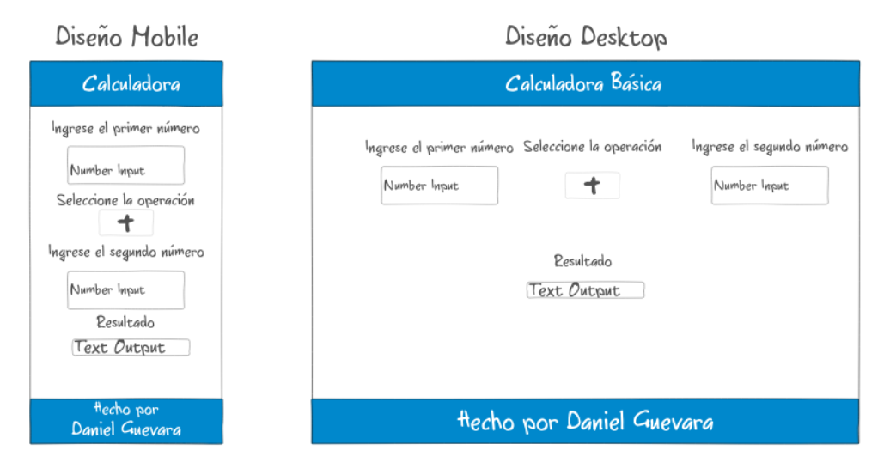

# Calculadora Simple

Calculadora simple para el semillero de mentores BIT

## Requerimientos
 * Se necesita realizar una calculadora que reciba 2 numeros, el usuario seleccione el operador entre los básicos: Suma, Resta, Multiplicación, División y que esta retorne el resultado.
## Mockups
 * 
## Proceso
 * Usando los mockups como base maquetamos con HTML y CSS básico para tener la estructura que queremos.
 * Agregamos la funcionalidad con JS y hacemos pruebas.
 * Reparamos el error de división sobre cero
 * Dejamos el proyecto para futuras mejoras.
### Realizado por Daniel Guevara
